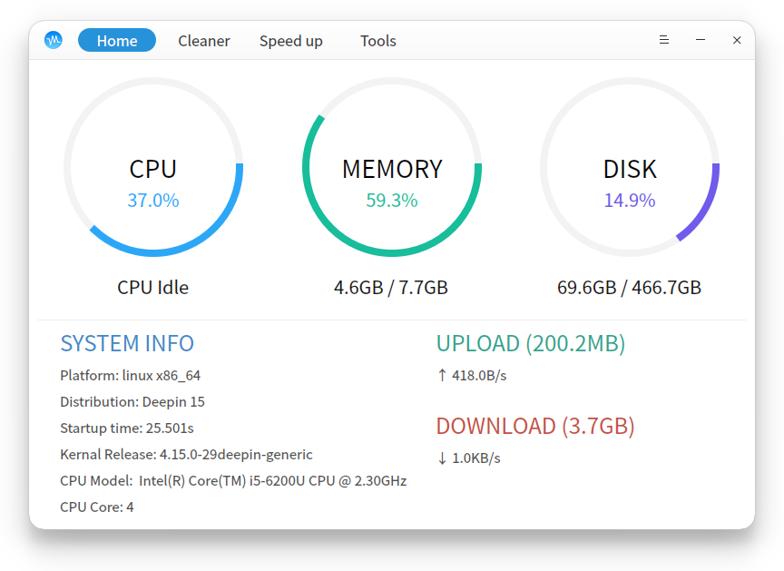

# GXDE System Assistant

A system assistant for GXDE 15 , based on sysbro

## Add Plugin

Install your standard `.desktop` file to `/usr/share/GXDE/gxde-system-assistant/tool-extensions` to show in GXDE System assistant tools page

## Developing

### Dependencies

* mk-build-deps (need devscripts installed) and install the generated deb file. 

### Build

* dpkg-buildpackage -us -uc -b

### License

GXDE System Assistant is licensed under GPLv3.
